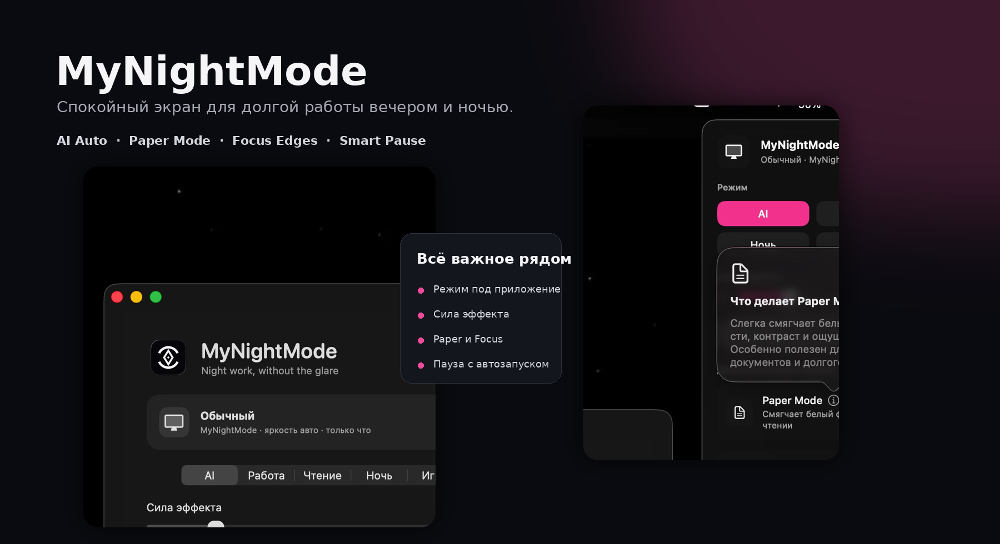
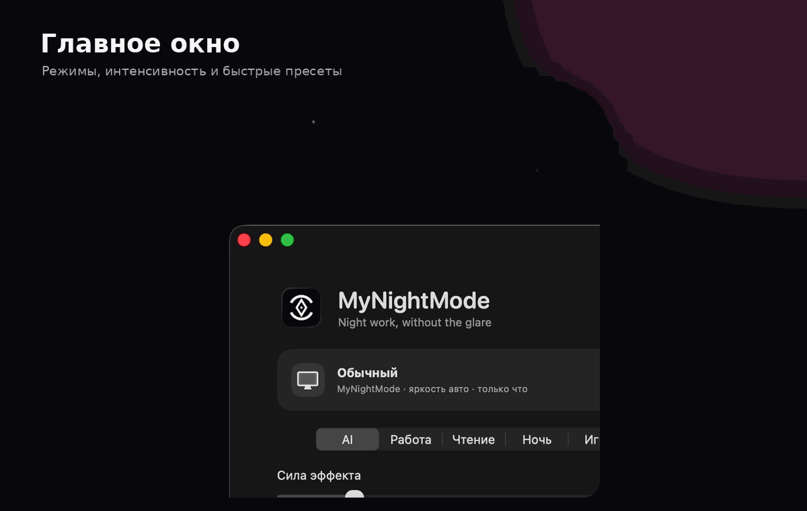
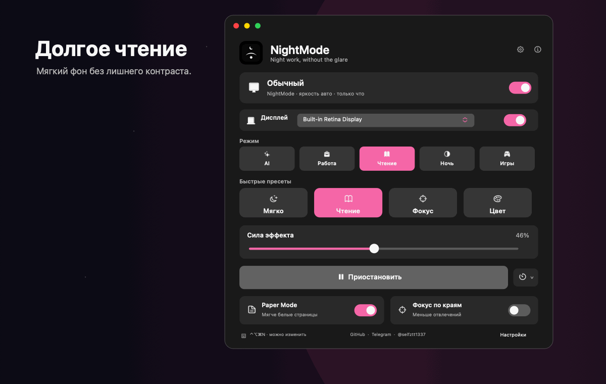
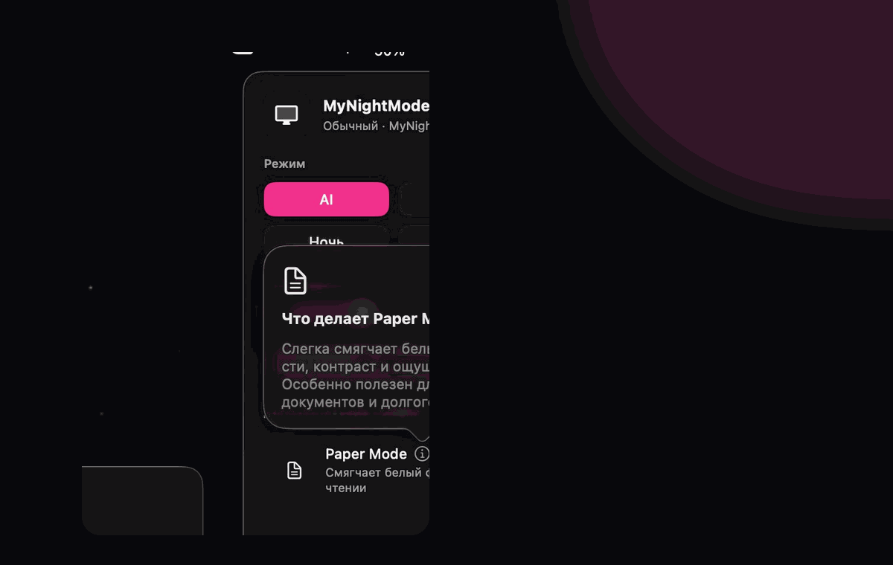

<p align="center">
  
</p>

<h1 align="center">MyNightMode</h1>

<p align="center">
  <strong>Адаптивный ночной режим для macOS.</strong><br>
  Мягче белый фон, меньше визуального шума, быстрые паузы и автоматические профили.
</p>

<p align="center">
  
  
  
</p>

<p align="center">
  
</p>

## Что делает

- **AI Auto** подбирает профиль под активное приложение, время и яркость.
- **Paper Mode** смягчает белые поверхности в документах, браузере и таблицах.
- **Focus Edges** слегка затемняет периферию и оставляет центр спокойнее.
- **Smart Pause** отключает эффект на 15–120 минут или до завтра 09:00.
- **Быстрые пресеты** переключают готовые сценарии в один клик.
- Работает локально, без Screen Recording и Accessibility.

## Интерфейс

<p align="center">
  
</p>

## Комфорт при чтении и работе

<p align="center">
  
</p>

## Smart Pause

<p align="center">
  
</p>

## Сборка

Требования: macOS 14+ и Xcode Command Line Tools.

```bash
chmod +x scripts/*.sh
./scripts/build_app.sh
```

Готовое приложение появится в:

```text
dist/MyNightMode.app
```

## Управление

- Иконка в menu bar — быстрые настройки
- `⌥⌘D` — включить или отключить эффект
- `?` — открыть обучение
- `ⓘ` — объяснение конкретной функции

## Приватность

MyNightMode не записывает экран, не читает содержимое окон и не отправляет данные в облако.

<p align="center">
  <sub>Made for calmer nights on macOS 🌙</sub>
</p>
