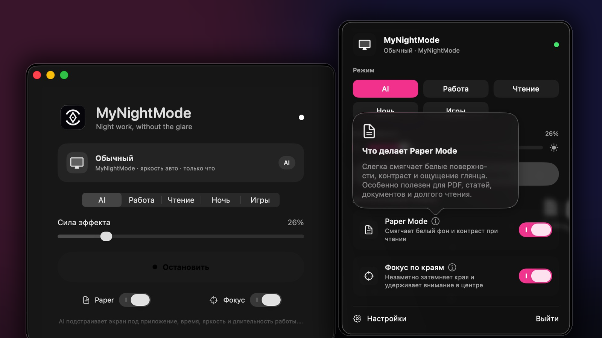
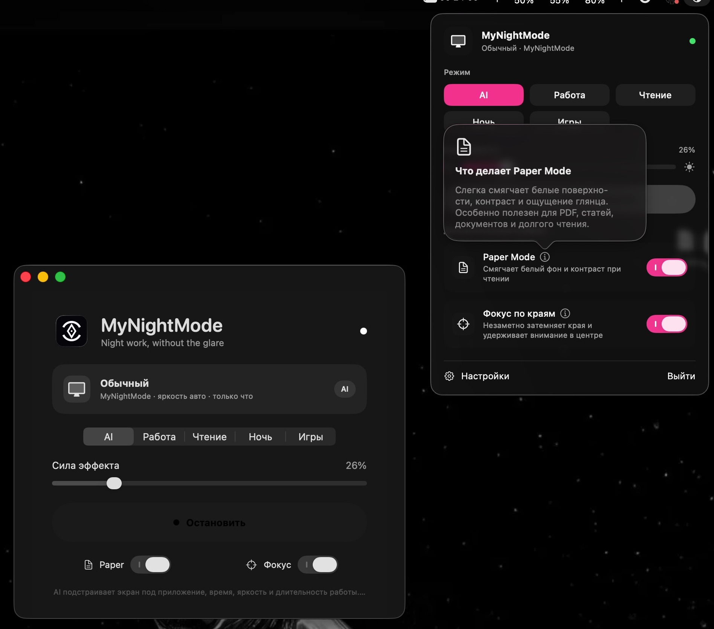

<p align="center">
  
</p>

<h1 align="center">MyNightMode</h1>

<p align="center">
  <strong>Умный ночной режим для macOS, который подстраивает экран под то, чем вы занимаетесь.</strong><br>
  Меньше бликов и визуального шума. Больше комфорта при долгой работе вечером и ночью.
</p>

<p align="center">
  
  
  
  
</p>

<p align="center">
  
</p>

## Экран становится комфортнее сам

MyNightMode отслеживает только **активное приложение, время суток, яркость дисплея и длительность сеанса**. На основе этого приложение локально выбирает профиль и регулирует силу эффекта.

| Когда вы… | MyNightMode… |
| --- | --- |
| пишете код | сохраняет читаемость текста и снижает яркость фона |
| читаете статью или PDF | смягчает белые поверхности с помощью **Paper Mode** |
| работаете в Miro или FigJam | затемняет края через **Focus Edges**, удерживая внимание в центре |
| редактируете фото или видео | почти отключает эффект, чтобы не искажать цвет |
| запускаете игру или фильм | минимально вмешивается в изображение |

## Главное

- **AI Auto** — выбирает подходящий профиль без ручного переключения.
- **Paper Mode** — делает белые интерфейсы мягче и уменьшает ощущение глянца.
- **Focus Edges** — незаметно затемняет периферию экрана и снижает визуальный шум.
- **Adaptive Overlay** — работает на всех дисплеях и Spaces.
- **Smart Pause** — временно отключает эффект и автоматически возвращает его позже.
- **Menu Bar Control** — быстрый доступ к режимам, силе эффекта и пояснениям.
- **Privacy by design** — всё работает локально, без Screen Recording и Accessibility.

<details>
<summary><strong>Как выглядят Paper Mode и Focus Edges в интерфейсе</strong></summary>
<br>
<p align="center">
  
</p>
</details>

## Быстрый старт

### Требования

- macOS 14 или новее
- Xcode Command Line Tools

### Сборка

```bash
chmod +x scripts/*.sh
./scripts/build_app.sh
```

Готовое приложение появится здесь:

```text
dist/MyNightMode.app
```

Запуск из проекта:

```bash
./scripts/run_app.sh
```

## Управление

- Иконка в menu bar — открыть быстрые настройки
- `⌥⌘D` — включить или отключить эффект
- `?` и кнопки `ⓘ` — открыть встроенные пояснения и обучение

## Приватность

MyNightMode не записывает экран, не читает его содержимое и не отправляет данные во внешние сервисы. Для работы используются только системные данные о текущем приложении и локальные настройки.

## Статус проекта

MyNightMode находится в активной разработке. Перед первым использованием соберите приложение на своём Mac и проверьте поведение на вашей версии macOS и конфигурации дисплеев.

## Лицензия

Разрешено личное некоммерческое использование и модификация. Условия распространения и коммерческого использования описаны в [`LICENSE.txt`](LICENSE.txt).

<p align="center">
  Made for calmer nights on macOS.<br>
  <strong>@selfztt1337</strong>
</p>
