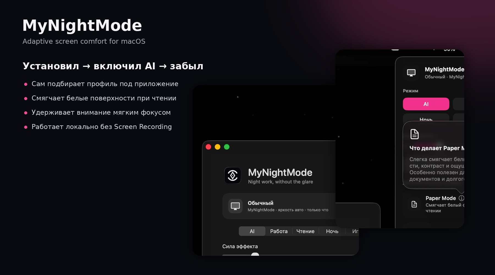
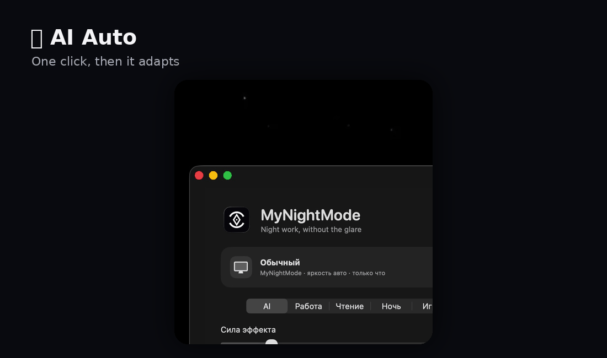
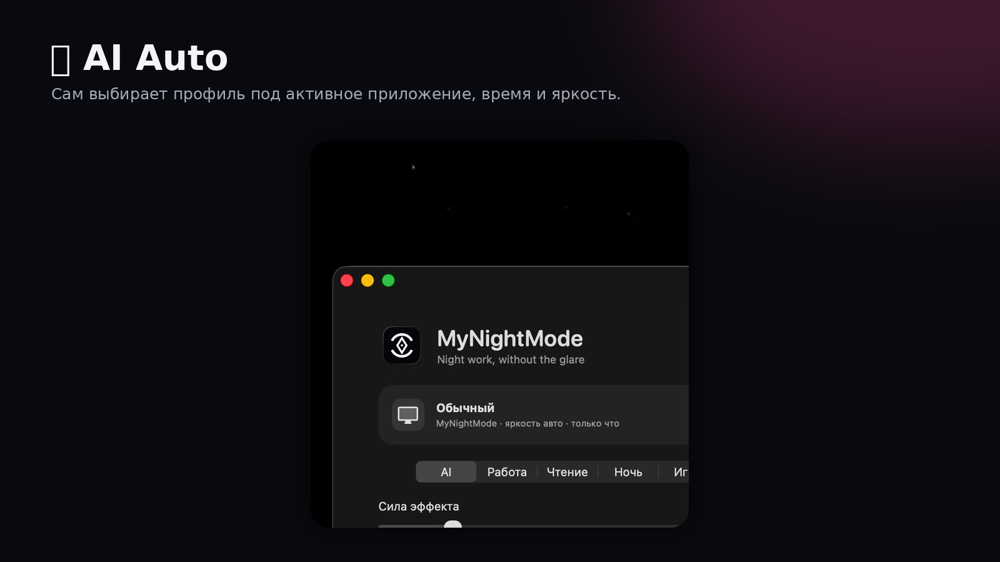
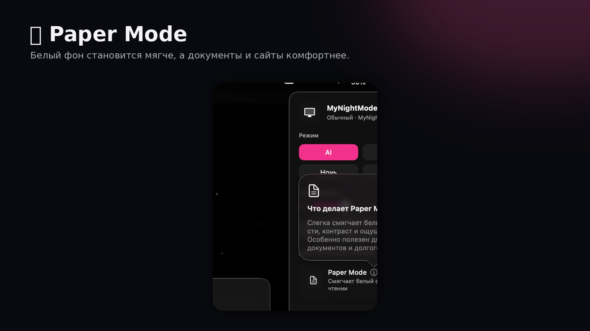
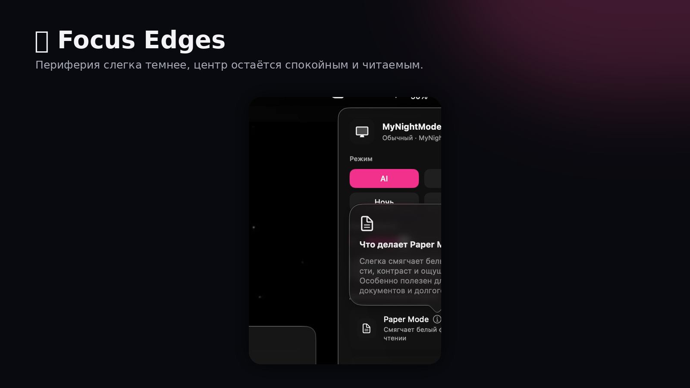
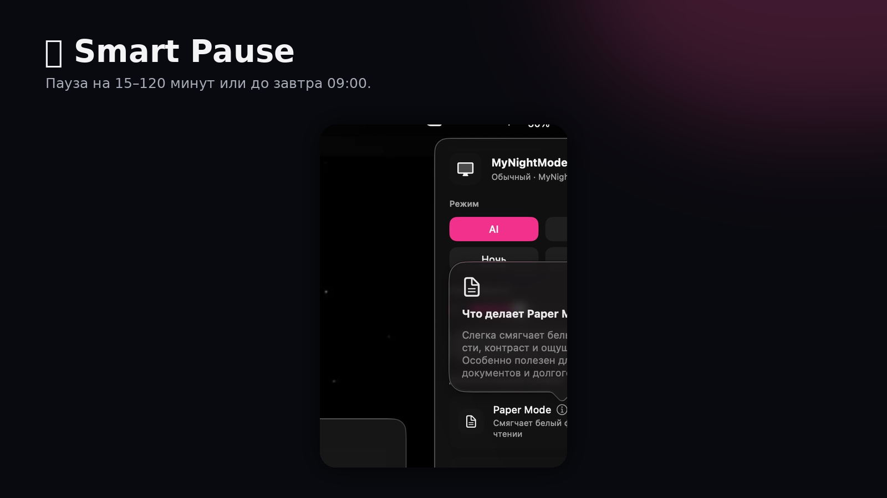
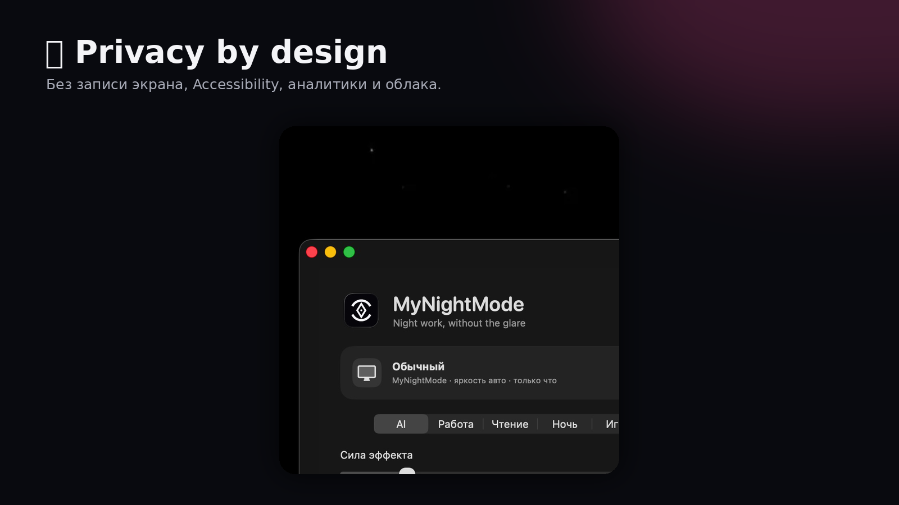

<p align="center">
  
</p>

<h1 align="center">MyNightMode</h1>

<p align="center">
  <strong>🌙 Спокойный экран. Лучше фокус. Меньше ручных настроек.</strong><br>
  Нативный адаптивный ночной режим для macOS, созданный для долгой работы вечером и ночью.
</p>

<p align="center">
  
  
  
  
</p>

<p align="center">
  
</p>

## ✨ Установил → включил AI → забыл

MyNightMode подстраивает экран под приложение, время, яркость и длительность текущей сессии.

- 💻 **Работа и код:** спокойнее фон, интерфейс остаётся читаемым.
- 📚 **Чтение:** Paper Mode смягчает PDF, сайты, таблицы и документы.
- 🎯 **Фокус:** Focus Edges приглушает периферию без блокировки интерфейса.
- 🎨 **Цвет:** режим с минимальным вмешательством для фото, видео и дизайна.
- ⏸️ **Пауза:** 15, 30, 60, 120 минут или до завтра 09:00.

## 🎬 Короткая демонстрация

<p align="center">
  
</p>

## 🚀 Что внутри

| | Функция | Польза |
|---|---|---|
| ✨ | **AI Auto** | Автоматически выбирает подходящий профиль |
| ⚡ | **Quick Presets** | Мягко, Чтение, Фокус и Цвет в один клик |
| 📄 | **Paper Mode** | Смягчает яркие белые поверхности |
| 🎯 | **Focus Edges** | Уменьшает визуальный шум по краям |
| ⏸️ | **Smart Pause** | Автоматически возвращает эффект после паузы |
| 👀 | **Break Timer** | Ненавязчиво предлагает сделать перерыв |
| 🖥️ | **Multi-display** | Работает на нескольких дисплеях и в Spaces |
| 🔒 | **Local-first** | Не записывает экран и не отправляет данные в облако |

## 🖼️ Возможности

<p align="center"></p>
<p align="center"></p>
<p align="center"></p>
<p align="center"></p>
<p align="center"></p>
<p align="center"></p>

## 🛠️ Сборка

**Требования:** macOS 14+ и Xcode Command Line Tools.

```bash
chmod +x scripts/*.sh
./scripts/build_app.sh
```

Готовое приложение появится здесь:

```text
dist/MyNightMode.app
```

Запуск:

```bash
./scripts/run_app.sh
```

## ⌨️ Управление

- Иконка в menu bar — быстрые настройки
- `⌥⌘D` — включить или отключить защиту
- `ⓘ` — объяснение конкретной функции
- `?` — повторно открыть обучение
- Нажатие на процент интенсивности — вернуть рекомендуемые 48%

## 🔒 Приватность

Без Screen Recording. Без Accessibility. Без облачной обработки. Без аналитики. Настройки и адаптация работают локально.

## 📦 Готовая сборка

Исходники хранятся в репозитории. Готовый `.app.zip` рекомендуется публиковать отдельно в **GitHub Releases**.

## 📄 Лицензия

Личное некоммерческое использование и модификация разрешены. Подробности: [`LICENSE.txt`](LICENSE.txt).

<p align="center">
  <strong>Made for calmer nights on macOS 🌙</strong>
</p>
