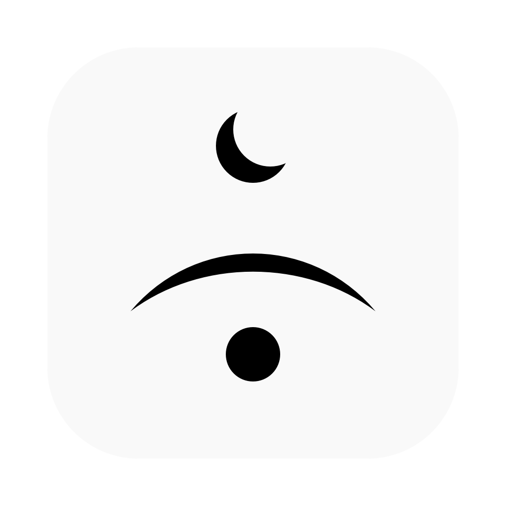
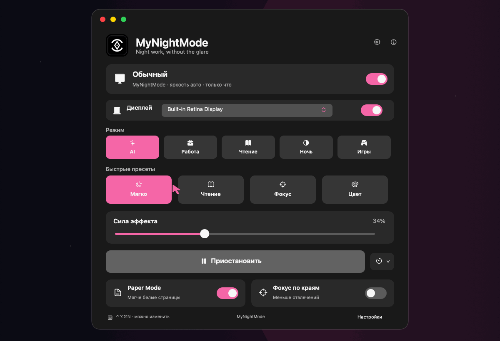
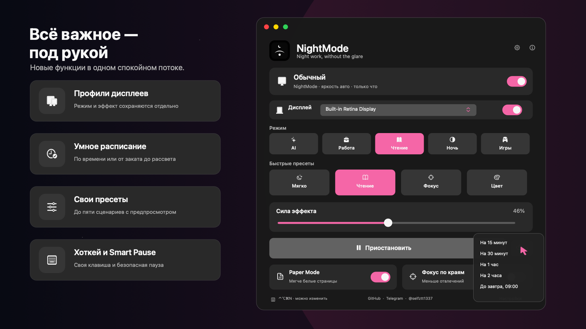

<p align="center">
  
</p>

<h1 align="center">NightMode</h1>

<p align="center">
  <strong>Адаптивный ночной режим для macOS.</strong><br>
  Мягче белый фон, меньше визуального шума, быстрые паузы и автоматические профили.
</p>

<p align="center">
  
  
  
</p>

<p align="center">
  
</p>

## Что делает

- **AI Auto** подбирает комфортное изображение с учётом активного приложения, яркости, времени суток и длительности работы.
- **Профили дисплеев** сохраняют отдельные параметры для каждого монитора.
- **Готовые и пользовательские пресеты** переключают сценарий в один клик.
- **Paper Mode и Focus Edges** смягчают белый фон и уменьшают визуальный шум.
- **Расписание** автоматически включает нужный режим утром, вечером или от заката до рассвета.
- **Smart Pause и свой хоткей** позволяют быстро остановить или вернуть эффект.
- Всё работает локально, без записи экрана и отправки данных.

## Интерфейс

<p align="center">
  
</p>

## Комфорт при чтении и работе

<p align="center">
  
</p>

## Основные возможности

<p align="center">
  
</p>

- Выберите дисплей и настройте режим, пресет и интенсивность.
- В AI-режиме параметры подбираются автоматически.
- Создайте до пяти собственных пресетов и проверьте их до сохранения.
- При необходимости поставьте эффект на паузу или назначьте свой хоткей.

## Установка

1. Скачайте `NightMode.app` или `.dmg` из раздела **Releases**:
   [github.com/selfztt1337/-MyNightMode/releases](https://github.com/selfztt1337/-MyNightMode/releases).
2. Если скачали `.dmg`, откройте его.
3. Переместите `NightMode.app` в папку **Applications** / «Программы».
4. Запустите NightMode из **Applications**.
5. Если macOS покажет предупреждение для локально подписанной сборки, откройте **Системные настройки → Конфиденциальность и безопасность** и подтвердите запуск.

NightMode не требует разрешений **Screen Recording** и **Accessibility**.

Для самостоятельной сборки нужны macOS 14+ и Xcode Command Line Tools:


```bash
chmod +x scripts/*.sh
./scripts/build_app.sh
```

Подробности: [BUILD.md](BUILD.md) · [TESTING.md](TESTING.md) · [PRIVACY.md](PRIVACY.md)

## Приватность

NightMode не записывает экран, не читает содержимое окон и не отправляет данные в облако.

<p align="center">
  <sub><a href="https://github.com/selfztt1337/-MyNightMode">GitHub</a> · <a href="https://t.me/selfztt1337">Telegram</a> · @selfztt1337</sub><br>
  <sub>Made for calmer nights on macOS 🌙</sub>
</p>
