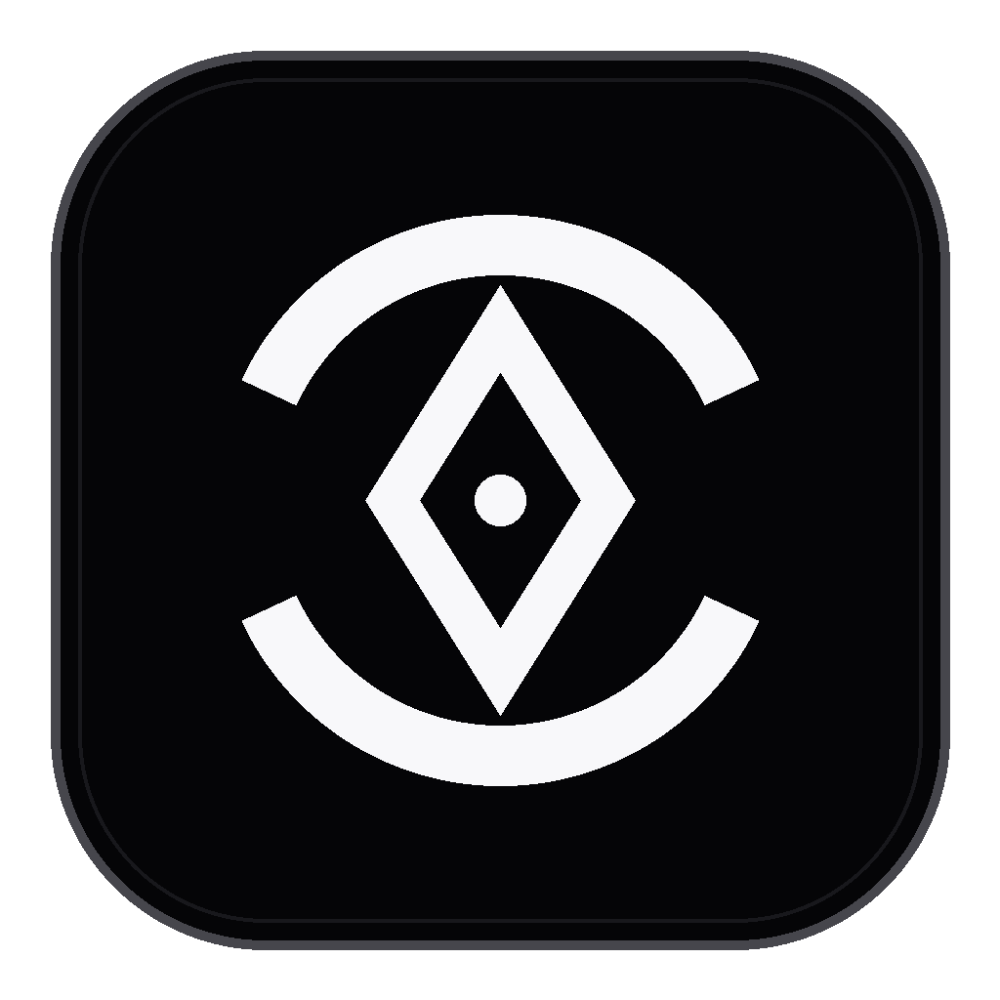
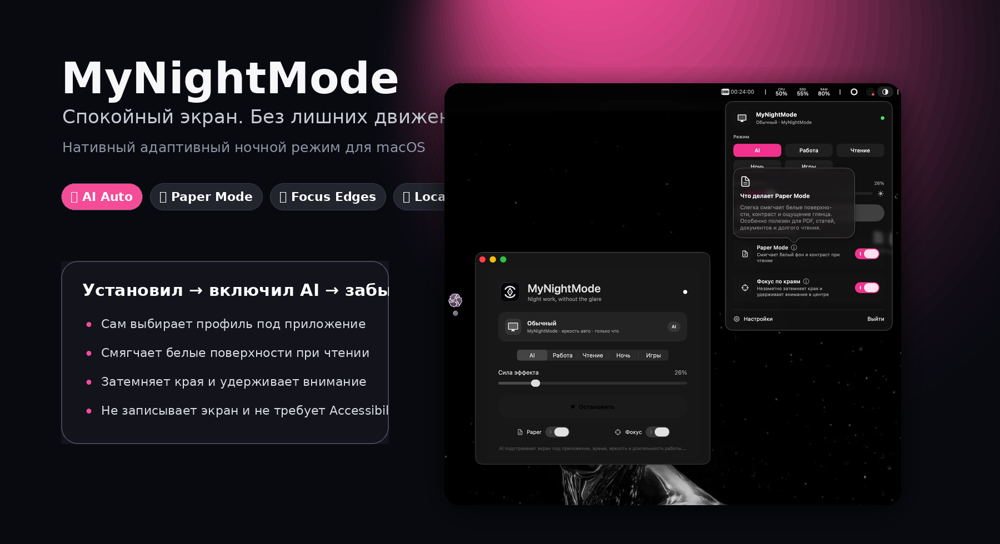
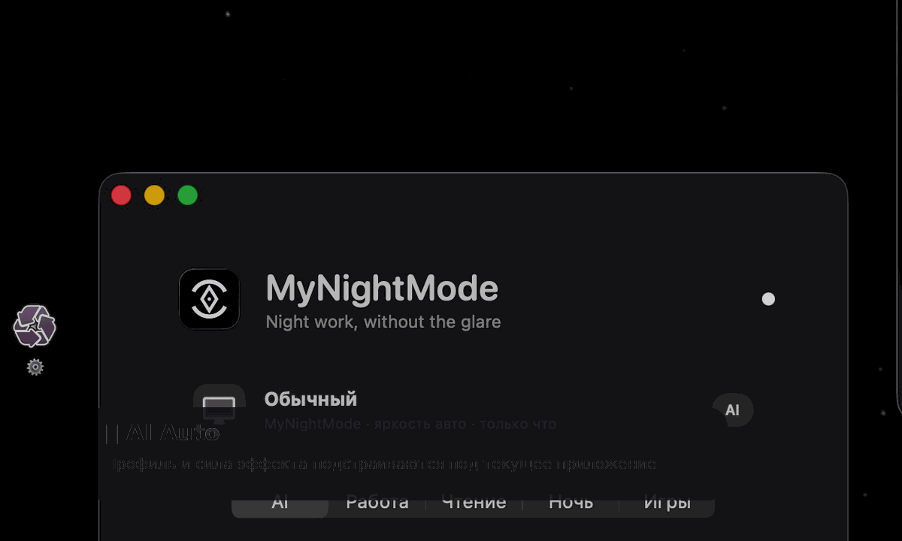
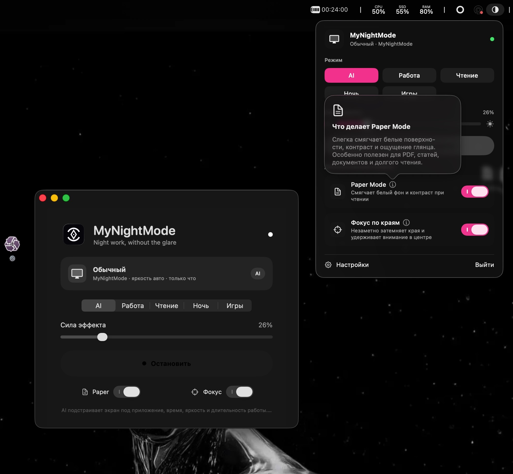

<p align="center">
  
</p>

<h1 align="center">MyNightMode</h1>

<p align="center">
  <strong>🌙 Спокойный экран для долгой работы вечером и ночью.</strong><br>
  AI Auto сам выбирает профиль, Paper Mode смягчает белый фон, а Focus Edges убирает визуальный шум по краям.
</p>

<p align="center">
  
  
  
  
</p>

<p align="center">
  
</p>

## ✨ Установил → включил AI → забыл

MyNightMode работает поверх macOS и мягко адаптирует экран под то, чем вы занимаетесь.

- 💻 **Код и работа** — снижает резкость яркого фона, не портя читаемость.
- 📚 **Чтение** — Paper Mode делает PDF, сайты и документы визуально мягче.
- 🎯 **Фокус** — Focus Edges незаметно затемняет периферию экрана.
- 🎨 **Фото и видео** — уменьшает вмешательство, когда важна точность цвета.
- 🎬 **Игры и фильмы** — почти отключает эффект, чтобы не мешать контенту.

## 🎬 Как это выглядит

<p align="center">
  
</p>

## 🚀 Главные фичи

| | Функция | Что даёт |
|---|---|---|
| ✨ | **AI Auto** | Сам выбирает режим по активному приложению, времени, яркости и длительности сессии |
| 📄 | **Paper Mode** | Смягчает белые поверхности и снижает ощущение глянца |
| 🎯 | **Focus Edges** | Затемняет края и помогает удерживать внимание в центре |
| ⚡ | **Menu Bar Control** | Все режимы, сила эффекта, пауза и пояснения в одном компактном окне |
| ⏸️ | **Smart Pause** | Отключает эффект на 15, 30 или 60 минут и включает обратно автоматически |
| 🖥️ | **Multi-display** | Работает на нескольких дисплеях и в разных Spaces |
| 🔒 | **Local-first** | Не записывает экран, не читает содержимое окон и не отправляет данные в облако |

## 🖼️ Актуальный интерфейс

<p align="center">
  
</p>

## 🛠️ Быстрый запуск

**Требования:** macOS 14+ и Xcode Command Line Tools.

```bash
chmod +x scripts/*.sh
./scripts/build_app.sh
```

Готовое приложение:

```text
dist/MyNightMode.app
```

Запустить из проекта:

```bash
./scripts/run_app.sh
```

## ⌨️ Управление

- Иконка в menu bar — открыть быстрые настройки
- `⌥⌘D` — включить или отключить эффект
- `?` и `ⓘ` — открыть пояснения и обучение
- **Smart Pause** — временно выключить эффект без потери настроек

## 🔒 Приватность без звёздочек

MyNightMode не делает скриншоты, не записывает экран, не требует Accessibility и не отправляет данные во внешние сервисы. Всё работает локально на Mac.

## 🧪 Статус

Проект находится в активной разработке. Сборка рассчитана на macOS 14+.

## 📄 Лицензия

Личное некоммерческое использование и модификация разрешены. Детали: [`LICENSE.txt`](LICENSE.txt).

<p align="center">
  <strong>Made for calmer nights on macOS 🌙</strong><br>
  <sub>@selfztt1337</sub>
</p>
